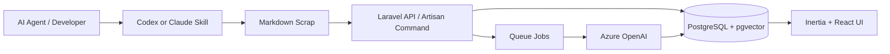

# AI エージェントの「消える plan」を業務ナレッジに変える Yomitoki

## はじめに

今回作った Yomitoki は、高度な RAG 単体を目指したアプリではありません。

テーマにしたのは、AI エージェントとの作業で生まれる Markdown 断片を、保存・要約・検索・文書生成へ回す小さな AI knowledge loop です。

AI を使ってコードを書く。  
AI が plan を作る。  
その plan を保存する。  
保存した plan を AI が要約する。  
あとから AI に探してもらう。  
複数の Scrap を AI が文書へ再構成する。

このように、AI の出力をその場限りにせず、次の AI 処理の材料として残していくことを試しました。

Microsoft Agent Hackathon powered by Tokyo Electron Device 向けには、Azure 上で動かし、Azure OpenAI を使った要約・検索・文書生成を行うアプリケーションとして提出する想定です。

## 作ったもの

Yomitoki は、AI エージェントや開発者が生成する Markdown 断片を Scrap として保存し、あとから読める・探せる・文書化できるようにする Web アプリです。

現在の MVP では、AI エージェントが作る plan と、その実行結果を主な入力にしています。

AI エージェントに実装を依頼すると、まず plan が作られます。  
そこには「何を作るのか」「なぜその方針にするのか」「今回はどこまでやるのか」といった、開発上の意思決定が含まれます。

しかし実際には、plan は承認後に CLI やチャット履歴の中を流れていきます。  
あとから「あの判断はなぜそうしたんだっけ？」と思っても、探すのが難しい。

Yomitoki は、その流れて消えがちな plan を Markdown Scrap として保存します。  
さらに、実装後の結果を子 Scrap として紐づけ、あとから読める形にします。

主な機能は次のとおりです。

- AI エージェントの plan を Scrap として保存
- 実行結果を plan の子 Scrap として保存
- Markdown preview
- Scrap のタイトル・slug 提案
- AI による要約
- pgvector を使った関連 Scrap 表示
- 関連 Scrap を文脈に入れた検索回答
- 複数 Scrap からの文書生成
- Scrap 単位のバックアップ

現在は plan / execution result が目立っていますが、データモデルは plan 専用ではありません。  
`source_type` を変えることで、note、research、meeting_note、daily_report、inquiry なども同じ Scrap として扱えます。

## 最初に作ろうとしていたもの

当初の目論見は、いわゆる LLM Wiki を PostgreSQL と Web UI で体現することでした。

参考にした考え方は、LLM が知識を単発で検索して答えるだけでなく、Markdown のページ群として知識を継続的に蓄積・再編集していく、というものです。

最初に想定していた入力は、会議メモ、問い合わせ、調査ログ、日報、設計ノート、仕様変更の背景といった業務上の断片でした。

それらを Scrap として保存し、AI があとから仕様書や整理文書へ再構成する。  
つまり、未整理な断片を業務ナレッジへ変換する作業台を作ろうとしていました。

しかし、一人で開発していると、会議メモや問い合わせのような想定データは自然には増えません。

一方で、実際に毎日大量に発生していたものがありました。  
AI エージェントが作る plan です。

そこで、当初の「業務断片から仕様書を作る」構想を保ちつつ、まずは自分が実際に毎日ぶつかっている課題に寄せることにしました。

AI エージェントの plan と実行結果を保存する。  
そして、それをあとから読める・探せる・文書化できるようにする。

これが今の Yomitoki の MVP です。

## Ultraplan から受けた影響

この方向性には、Claude Code の Ultraplan から受けた影響もあります。

Ultraplan は、ローカル CLI で始めた planning task を Claude Code on the web に渡し、クラウド上で plan を作成して、ブラウザでレビュー・コメント・修正できる機能です。  
長い plan をターミナルで読むのではなく、Web 上のレビュー UI で扱えるようにする点が特徴です。

これは、plan が単なる中間出力ではなく、レビューされるべき成果物になりつつあることを示しているように感じました。

複雑な実装計画は Markdown として長くなります。  
コンソールだけで全体構造を確認したり、気になる箇所にコメントしたり、修正された plan を比較したりするのはかなり厳しいです。

Ultraplan はこの問題に対して、Claude Code と密接に連携した体験を提供します。  
Web で inline にコメントし、修正し、承認後にそのまま Claude Code へ戻して実行できます。

一方で、Yomitoki はそこまで agent runtime と密結合することを目指していません。  
Web 上で inline 修正した内容を、そのまま Claude Code の実行セッションへ通知するような体験は、現時点では持っていません。

代わりに Yomitoki が重視しているのは、ツール横断の収集です。

Claude Code、Codex、GitHub Copilot、あるいは plan 機能を持たない別のツールや人間が作った Markdown の事前計画を、同じ Scrap として集める。  
Web 上で読みやすく保存し、あとから検索し、実行結果や補足メモと紐づけ、必要なら文書化する。

Ultraplan が Claude Code の planning workflow を強くする機能だとすれば、Yomitoki は plan や実行結果を、ツールをまたいで残せる AI 作業ログとして保存する場所です。

## アーキテクチャ

構成は次のようになっています。



主な技術要素は以下です。

- Laravel 13
- Laravel React Starter Kit
- Inertia.js
- React
- PostgreSQL
- pgvector
- Laravel AI SDK
- Azure OpenAI
- Azure のアプリケーション実行基盤

Laravel AI SDK を使うことで、アプリケーション側は provider 固有の API に強く依存しない形にしています。  
開発中は Bedrock で動かしていた部分もありますが、提出版では Azure OpenAI へ差し替えて、要約・文書生成などの AI 処理に利用します。

## 技術スタックとしての狙い

今回のもう一つのテーマは、AI を使った高速な Web アプリケーション開発です。

Yomitoki は Laravel 13 + React + Inertia.js で作っています。  
この構成は、AI エージェントと一緒に短期間でプロダクトを作るうえでかなり相性が良いと感じました。

ベースには Laravel React Starter Kit を使っています。  
Laravel 公式の React starter kit は、Inertia.js を使って Laravel の server-side routing / controller と React frontend をつなぐ構成です。

個人的には、この構成を使った実際の成果物を出したいという気持ちもありました。  
Laravel + React + Inertia.js の組み合わせは、Laravel 界隈では公式 starter kit として用意されている一方で、まだ一般に広く使われている印象はそこまで強くありません。

しかし、実際に作ってみると、AI エージェントと一緒に開発するうえでかなり扱いやすい構成でした。

Laravel は、認証、ルーティング、バリデーション、キュー、ファイル保存、テスト、DB migration など、Web アプリに必要な土台が最初から揃っています。  
今回も Fortify による認証、Queue job による AI 処理、PostgreSQL / pgvector を使った保存と検索、Artisan command による agent skill 連携を、Laravel の標準的な構成の上に組み立てています。

React は、Markdown preview、検索チャット、Scrap の選択、Document 生成、バックアップ進捗など、状態を持つ UI を作るために使っています。

Inertia.js は、この 2 つをつなぐ役割です。  
API を細かく分けて SPA を作り込むのではなく、Laravel の controller から page props を返し、React 側で画面を組み立てます。  
これにより、サーバー側の認可やデータ取得を Laravel に寄せたまま、フロントエンドは SPA の操作感を持てます。

AI エージェントに実装を頼むときも、この構成は扱いやすいです。  
「この controller で props を返す」「この Form Request で validate する」「この Inertia page に UI を足す」「この Pest test で確認する」という単位が明確だからです。

Laravel 13 + React + Inertia.js は、派手な構成ではありません。  
しかし、短期間で実用的な AI アプリを作るには、かなり堅実で速い組み合わせだと思います。

## データモデル

中心になるのは `scraps` テーブルです。

Scrap は次のような情報を持ちます。

- title
- slug
- content_markdown
- summary
- source_type
- status
- parent_id
- meta
- embedding

`parent_id` により、plan と実行結果を親子関係で紐づけられます。

また、`documents` と `document_scraps` により、複数 Scrap から生成された文書と、その元になった Scrap の関係を保持します。

これにより、単に Markdown を保存するだけでなく、「どの断片からこの文書が作られたか」を辿れるようにしています。

## AI 活用のポイント

Yomitoki では、AI を単発のチャット回答だけに使うのではなく、Scrap のライフサイクルに組み込んでいます。

Scrap が保存されると、AI が要約を生成します。  
必要に応じてタイトルや slug の候補も提案します。  
複数 Scrap を選択すると、AI がそれらをもとに仕様書や概要ドキュメントを生成します。

検索では、関連する Scrap を取得し、それを文脈として AI に渡して回答します。

重要なのは、AI の出力をその場限りにしないことです。  
AI が作った plan も、実行結果も、生成された文書も、次の AI 処理で再利用できる Scrap / Document として残ります。

## 検索はまず「過去の plan を思い出す」ために使う

現時点の検索は、立派な推論エンジンというより「過去に作った plan を思い出す」ためのものに近いです。

たとえば、

> syntax highlighting の plan ってどれだっけ？

という質問にはかなり向いています。  
保存済みの plan の title、summary、本文から embedding を作っておき、質問に近い Scrap を探します。  
そして「過去に syntax highlighting を検討した plan」として関連 Scrap を AI に渡し、その内容をもとに回答します。

構造としては、現時点では retrieval-assisted answering です。  
つまり、AI がゼロから高度な推論をしているというより、pgvector で近そうな Scrap を取得し、その Scrap を context に入れて回答しています。

一方で、

> なんで syntax highlighting しようと思ったんだっけ？

という問いに安定して答えるのは、今のままだと難しいです。

理由は単純で、現在保存されている情報は主に「何をしたか」だからです。  
「なぜそう判断したか」「他にどんな選択肢があったか」「その前に何に困っていたか」は、plan や execution result に明示されていなければ残りません。

この差分は、Yomitoki の今後の面白いテーマだと思っています。

AI エージェント時代には、what だけでなく why をどう残すかが重要になります。  
将来的には plan 保存時に `problem`、`motivation`、`decision`、`alternatives`、`expected_outcome`、`result` のような情報を抽出し、Scrap の構造化メタデータとして保存したいです。

今の Yomitoki は、まず「どの plan だったか」を思い出すところから始めています。  
次に目指したいのは、「なぜその plan が必要だったのか」まで辿れることです。

## デモで見せること

デモでは、次の流れを見せます。

1. AI エージェントが作った plan が Yomitoki に保存される
2. Dashboard で Markdown として読みやすく表示される
3. 実行結果が子 Scrap として紐づく
4. Search で「syntax highlighting の plan ってどれだっけ？」と聞く
5. 関連 Scrap をもとに AI が回答する
6. 複数 Scrap を選んで Document を生成する

これにより、AI エージェントとの作業で発生した文脈が、単なる履歴ではなく、再利用可能な業務ナレッジになることを示します。

## 外部 ingest API で広げたいこと

現在の最大の弱点は、入力導線が Yomitoki 自身の開発 plan に寄りすぎていることです。

そこで次の一手として、外部プロジェクトから Markdown Scrap を送信できる HTTP API を用意します。

```http
POST /api/scraps
Authorization: Bearer {token}
Content-Type: application/json
```

```json
{
  "title": "外部プロジェクトの実装計画",
  "source_type": "plan",
  "project": "sample-app",
  "content_markdown": "# Plan\n\n外部プロジェクトから送信された Markdown です。"
}
```

これにより、Yomitoki は自分自身の plan previewer ではなく、複数プロジェクトの AI 作業文脈を集約するハブになります。

この API は、将来的には Codex や Claude Code の skill、GitHub Actions、ローカル CLI などから利用できます。

## 工夫した点

### plan 専用にしない

現在の UI は plan を中心に見えますが、データ構造は plan に閉じていません。

`source_type` と `meta` により、さまざまな種類の Markdown 断片を扱えるようにしています。

### Markdown を主役にする

AI エージェントや開発者が自然に生成するテキストは、多くの場合 Markdown です。

Yomitoki は Markdown を無理に独自構造へ変換せず、そのまま保存し、Web 上で読みやすく preview します。

### 親子関係を持たせる

plan と実行結果、メインメモと補足メモのような関係を `parent_id` で表現しています。

これにより、単発のメモではなく、作業の流れを辿れるようにしています。

### 文書生成につなげる

Scrap は保存して終わりではありません。

複数の Scrap を選び、AI で仕様書や概要ドキュメントに再構成できます。

これは、当初の LLM Wiki 的な構想に近い部分です。

## まだ弱いところ

正直に言うと、プロダクトとしてはまだ洗練されていません。

特に、次の点は今後の課題です。

- 外部 ingest API の運用設計
- 複数プロジェクトの見せ方
- Azure OpenAI への完全な移行確認
- embedding 次元と pgvector schema の調整
- why を安定して答えるための理由・代替案・結果の構造化
- concept page 的な知識整理
- Scrap 同士の関係の自動発見
- LLM Wiki としての lint / maintenance

ただし、今回の MVP では、まず一番実際に発生している raw source である AI エージェントの plan と実行結果を扱えるところまでを目標にしました。

## 今後

今後は、Yomitoki をより LLM Wiki 的な方向へ伸ばしたいと考えています。

具体的には、次のような機能です。

- 外部プロジェクトからの Scrap ingest
- GitHub repository 単位の project 管理
- plan 以外の meeting note / research / daily report の投入
- Scrap から concept page を自動生成
- 古くなった Scrap や矛盾した Scrap の検出
- 生成された Document の継続的な更新

最終的には、AI エージェントや人間が日々生成する Markdown 断片が、そのまま組織や個人の知識ベースとして育っていく状態を目指しています。

## まとめ

Yomitoki は、AI エージェントの plan を保存するためのアプリに見えます。

しかし本質は、AI エージェントや開発者が生成する Markdown 断片を Scrap として集め、Azure OpenAI による要約・検索・文書生成によって、再利用可能な業務ナレッジに変換することです。

当初の LLM Wiki 構想から始まり、開発中に実際に困った「AI エージェントの plan が消える」問題に寄せて MVP を作りました。

plan は成果物です。  
そして、その plan には開発の判断理由が詰まっています。

Yomitoki は、その流れて消えがちな判断の文脈を、あとから読める形で残すための試みです。
